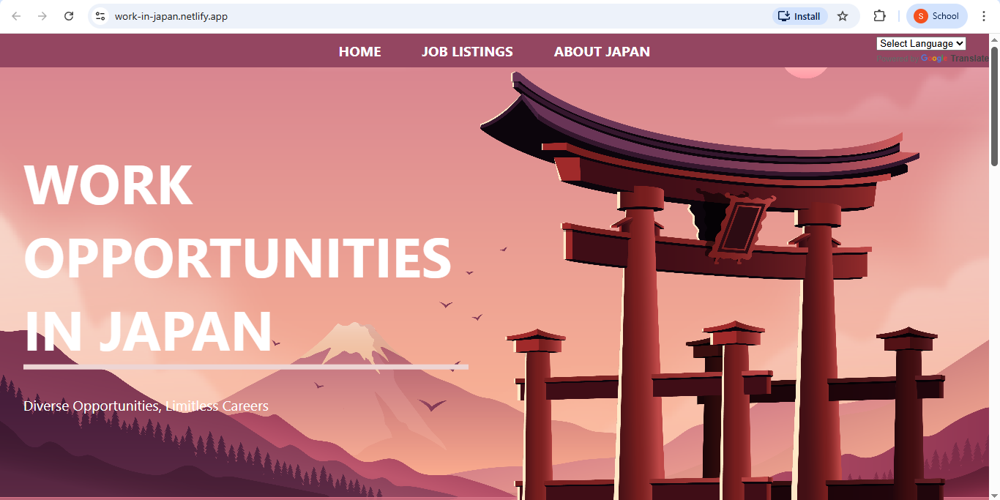
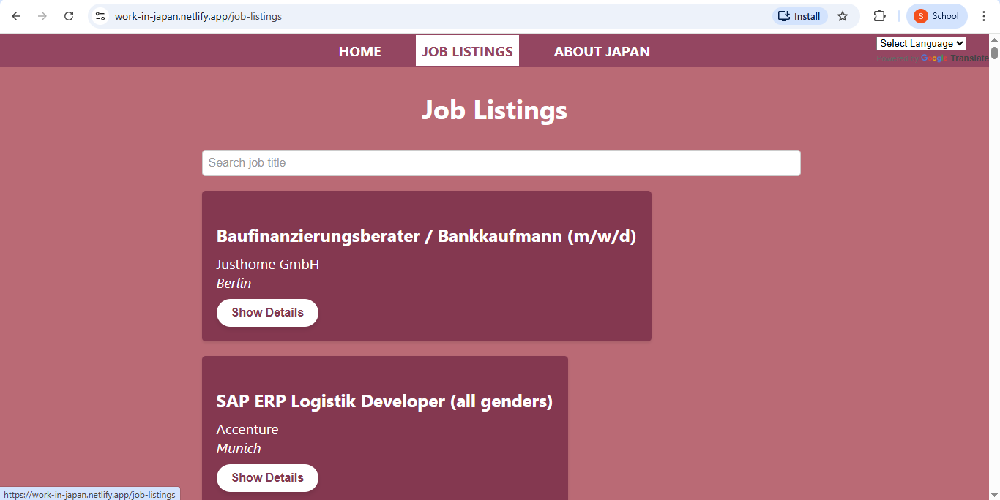
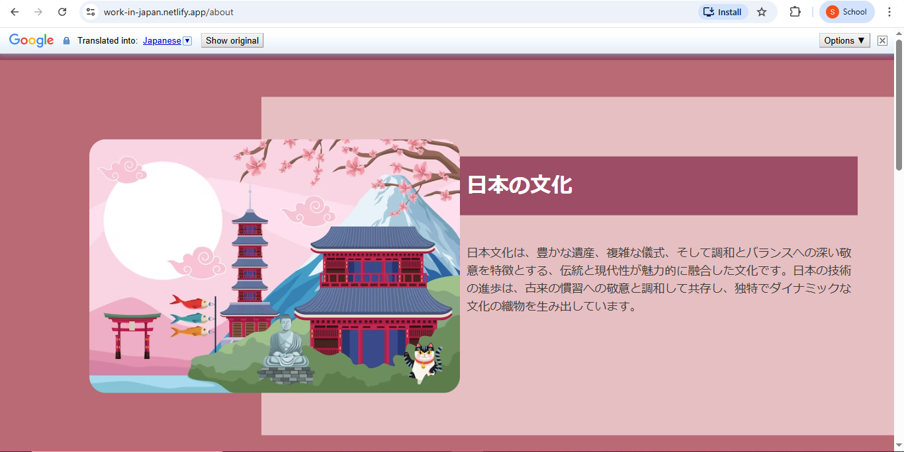

# Work in Japan – Job Portal

A React-based web application that displays job opportunities in Japan along with cultural information about the country.
The application also supports **English and Japanese language switching** using the Google Translate API.

This project demonstrates frontend development using **React, Context API, and REST API integration**.

---

## Features

* Browse job opportunities in Japan
* View job listings fetched from an open-source API
* Expand job cards to see detailed job descriptions
* Learn about Japanese culture and traditions
* Switch between **English and Japanese languages**
* Clean card-based UI for job listings
* Responsive layout

---

## Application Pages

### Home

Displays informational cards highlighting career opportunities in Japan such as:

* High demand for skilled professionals in technology
* Opportunities in finance and banking
* International work culture
* Growing global job market

### Job Listings

* Fetches job listings using a public API
* Displays jobs in card format
* Each card shows:

  * Job Title / Designation
  * Company Name
  * Location
* A **Show Details** button expands the card to display the full job description

**Note:** Job data is fetched from an open-source API. While the platform focuses on opportunities in Japan, the API may occasionally return listings from other countries.

### About Japan

Provides a brief introduction to Japanese culture including:

* Japanese culture and traditions
* Tea ceremony in Japan
* Japanese food and lifestyle

---

## Language Support

The application supports **two languages**:

* English (default)
* Japanese

Language translation is implemented using **Google Translate API**.

---

## Tech Stack

* **React JS**
* **Context API** (global state management)
* **Fetch API** (API calls)
* **Google Translate API**
* **CSS**

---

## Project Architecture

```
src
│
├── assets
│
├── components
│   ├── Layout
│   └── translate
│
├── pages
│   ├── Home
│   ├── JobListings
│   └── AboutJapan
│
├── store
│
├── App.js
├── index.js
└── index.css
```

---

## Screenshots







---

## Installation and Setup

### 1. Clone the repository

```bash
git clone https://github.com/Sawant-Raj/Work-in-Japan.git
```

### 2. Navigate to project folder

```bash
cd Work-in-Japan
```

### 3. Install dependencies

```bash
npm install
```

### 4. Run the development server

```bash
npm start
```

The application will start at:

```
http://localhost:3000
```
